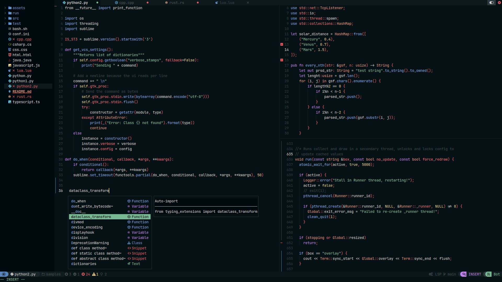
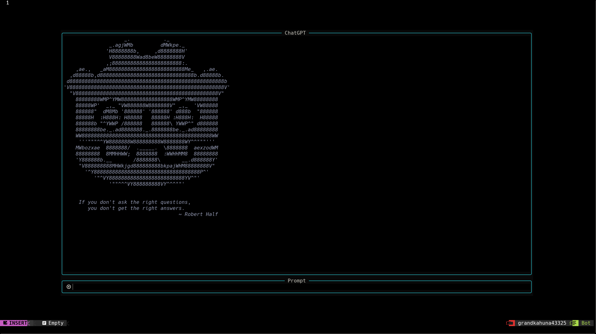

# Neovim_config

# Showcase

### ChatGPT

## This is customized NvChad with some remaps and built in ChatGPT

### If you are looking for some information I encourage you to read [this](https://nvchad.com)

#### If you don't know shortcuts press space+ch. In the custom section are ones that I made.

## Installation

**If your neovim config directory is different than mine(~/.config/nvim/) you schould change the directories in the commands!!!**

### If you have neovim nerdfonts ripgrep and gcc you can skip this step

Install homebrew with this command:

`/bin/bash -c "$(curl -fsSL https://raw.githubusercontent.com/Homebrew/install/HEAD/install.sh)"`

After installation you schould paste this commands(they will finish installing brew and they will install gcc nvim and ripgrep):

`(echo; echo 'eval "$(/home/linuxbrew/.linuxbrew/bin/brew shellenv)"') >> ~/.profile && eval "$(/home/linuxbrew/.linuxbrew/bin/brew shellenv)" && brew install gcc && brew install nvim && brew install ripgrep`

If you don't have [nerdfonts](https://www.nerdfonts.com/#home) you really schould install it. I won't cover it here because it's really easy and you can find a ton of articles like [this one](https://ostechnix.com/install-nerd-fonts-to-add-glyphs-in-your-code-on-linux/).

### If you have all the requirements you can proceed

Paste this command:

`git clone https://github.com/NvChad/NvChad ~/.config/nvim --depth 1 && nvim`

You will be asked if you want to install the NvChad press y and when the installation is finished copy this command:

Now we are going to replace the NvChad config with this one using this two commands:

**You will see some errors but just press enter.**

`rm -rf ~/.config/nvim && git clone https://github.com/Grandkahuna43325/Neovim_config ~/.config/nvim --depth 1 && nvim`

We are almost finished. You just need to add your openai api key to $OPENAI_API_KEY variable. Follow [this](https://elephas.app/blog/how-to-create-openai-api-keys-cl5c4f21d281431po7k8fgyol0) tutorial and when you finish paste this command:

`echo export OPENAI_API_KEY=YOUR_API_KEY >> ~/.bashrc && source ~/.bashrc`

If you are using bash and not zsh it schould work, but if you are using zsh paste this command:

`echo export OPENAI_API_KEY=YOUR_API_KEY >> ~/.zshrc && source /.zshrc`
